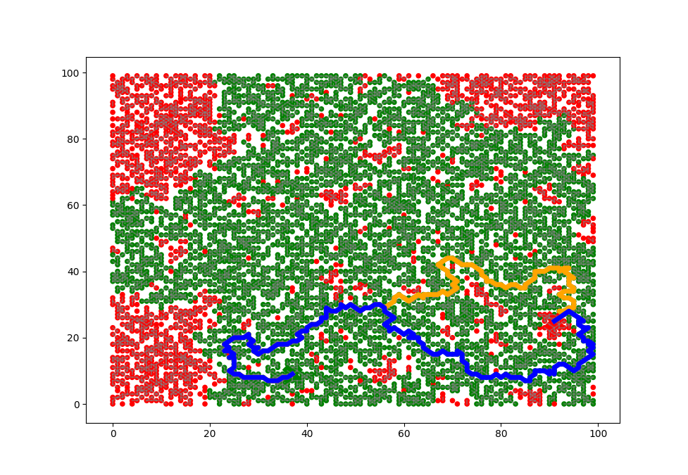

# Navigator

An excersize in problem solving using Object Oriented Principles

[Check out my blog for more info](https://landbelenky.wordpress.com/2019/10/04/a-navigation-app-from-scratch-in-less-than-200-lines-of-code/)

